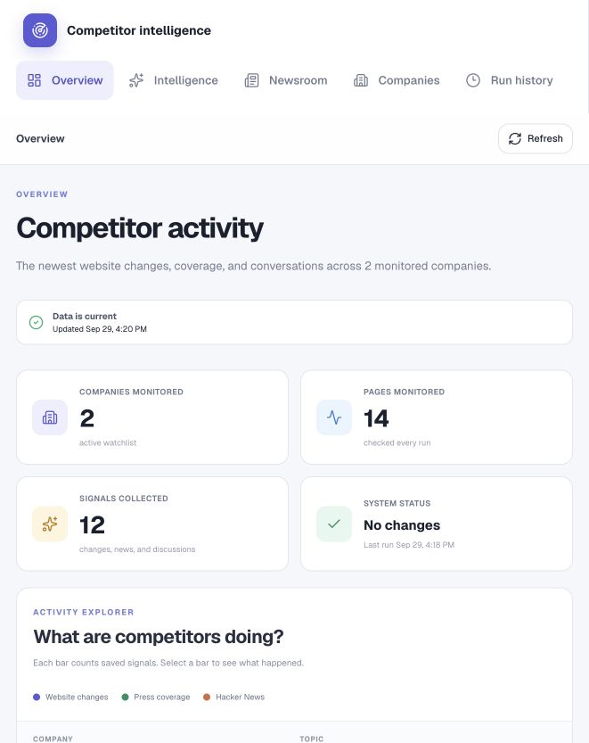
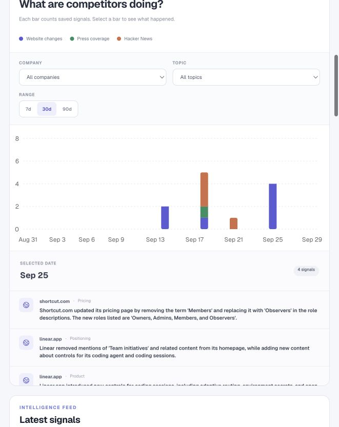
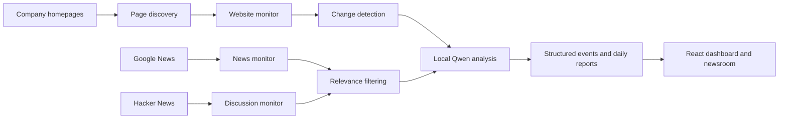

# CompetitorMonitor

An automated competitor-intelligence dashboard that turns website changes, news coverage, and Hacker News discussions into concise, useful signals.

**Status:** working MVP · **Tracked companies:** Linear and Shortcut · **AI:** local `qwen3:8b` through Ollama

## Why I built it

Important competitor updates are scattered across pricing pages, changelogs, company news, and online discussions. Checking each source manually is slow, and most updates are not meaningful.

CompetitorMonitor collects those sources, identifies new information, filters out noise, and presents the useful results in one dashboard.

## What it does

- Discovers useful pages from each company homepage, including pricing, product, changelog, customer, and careers pages.
- Monitors multiple pages concurrently and compares each new snapshot with the previous version.
- Searches recent company news and Hacker News discussions without scanning every article on the internet.
- Uses a local Qwen model to judge relevance and explain why a signal may matter.
- Stores permanent change events while limiting raw snapshots to prevent unnecessary growth.
- Generates a daily report and refreshes an interactive dashboard.
- Runs automatically at 3:00 PM on macOS and catches up after the next login or wake if the scheduled run was missed.

## Dashboard

The dashboard is designed to make the most important information visible first:

- overview metrics for companies, pages, signals, and monitor health;
- an interactive activity chart with company, topic, and time-range controls;
- a chronological activity calendar;
- company-level monitoring status and recent AI insights;
- a separate newsroom for articles and summaries.





The dashboard reads generated monitoring data from `dashboard/public/monitor-data.json`.

## How it works



The monitors collect factual data first. AI analysis is a separate layer, so collection can continue even when Ollama is unavailable.

## Technical decisions

- **Local AI:** Ollama keeps analysis private and avoids per-request API costs.
- **Targeted discovery:** the crawler selects useful internal pages instead of crawling an entire domain.
- **Two-stage news filtering:** inexpensive text checks remove obvious mismatches before relevant candidates reach the AI model.
- **Bounded storage:** only the 10 newest raw snapshots are retained for each page; permanent change events remain available for history.
- **Controlled concurrency:** website requests run in parallel while local AI work remains sequential to fit a 16 GB laptop.
- **Structured outputs:** Pydantic validates AI results before they are saved or displayed.
- **Resilient pipeline:** a missing local AI service produces a warning rather than stopping factual collection.

## Technology

- Python, Requests, Beautiful Soup, Pydantic, and `difflib`
- Ollama with Qwen 3 8B
- React 19, TypeScript, Tailwind CSS, Recharts, and Vinext
- macOS LaunchAgents for local daily automation

## Run locally

### 1. Install the Python environment

From the project folder:

```bash
python3 -m venv .venv
source .venv/bin/activate
pip install -r requirements.txt
```

### 2. Prepare local AI

Install [Ollama](https://ollama.com/download), then download the model once:

```bash
ollama pull qwen3:8b
```

No Ollama account or paid API key is required.

### 3. Run the complete monitor

```bash
.venv/bin/python run_monitor.py
```

This checks websites, news, and Hacker News; creates a report; and refreshes the dashboard data.

### 4. Open the dashboard

In a second terminal:

```bash
cd dashboard
pnpm install
pnpm dev
```

Open `http://localhost:3000`.

## Add a company

Add its homepage on a new line in `tracked_pages.txt`:

```text
https://example.com
```

The page-discovery step will select up to eight useful internal pages. A specific deeper URL can also be added manually when needed.

## Main project files

| File | Purpose |
| --- | --- |
| `run_monitor.py` | Coordinates one complete monitoring run. |
| `page_discovery.py` | Finds and caches useful pages from a company homepage. |
| `crawler.py` | Downloads, cleans, snapshots, and compares website text. |
| `news_monitor.py` | Searches for recent articles and filters irrelevant results. |
| `hacker_news_monitor.py` | Finds useful company discussions on Hacker News. |
| `ai_analyzer.py` | Turns website changes into structured competitive insights. |
| `generate_dashboard_data.py` | Converts saved results into dashboard-ready JSON. |
| `dashboard/` | Contains the interactive overview and newsroom. |
| `run_daily_monitor.sh` | Runs the monitor once per day and records its status. |

## Automation notes

The included macOS installer automatically uses the folder where the project is saved. It runs the monitor at 3:00 PM, prevents duplicate same-day runs, starts Ollama when possible, and records logs in `automation_logs/`.

To install it, double-click `install_daily_automation.command` on macOS after completing the local setup above.

This is local automation, not an always-on cloud service. The Mac must eventually be powered on and signed in; a missed run catches up after the next login or wake.

## Testing

The automated checks in `tests/` cover change-event creation, snapshot retention, page-discovery caching, news prefiltering, AI availability checks, and parallel page checks.

```bash
for test_file in tests/test_*.py; do PYTHONPATH=. .venv/bin/python "$test_file" || exit 1; done
```

## Privacy and repository hygiene

- Local environment files, virtual environments, dependency folders, logs, raw snapshots, reports, and generated monitoring history are excluded from Git.
- The repository contains source code and a dashboard data sample, not private API credentials.
- AI analysis runs locally through Ollama.

## Current limitations

- Scheduled monitoring depends on a signed-in Mac rather than an always-on cloud worker.
- Website structures and publisher rate limits can affect collection.
- The MVP currently tracks two companies; broader scale would benefit from a database and background job queue.
